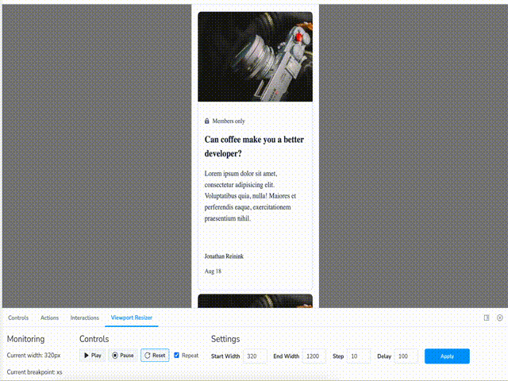
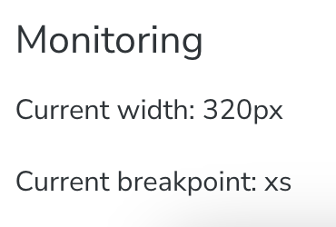
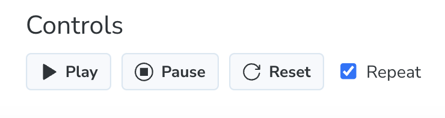
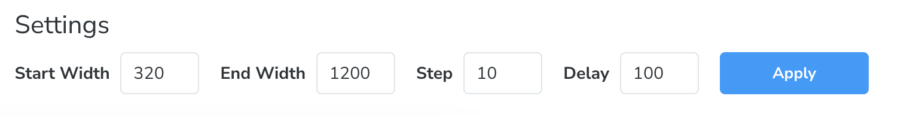

# Storybook Addon Viewport Resizer

An addon for testing responsive designs.

"Viewport Resizer" helps you test the whole spectrum of the possible widths and not only certain pre-defined devices. This is done by steadily incrementing the width of the story container over time.

To enable both container **and** media queries, the iframe of the preview is resized, instead of a custom decorator.



## Description

The addon is currently divded in three sections.

### Monitoring



In the monitoring section, you can see the current width of the iframe, and - if configured - the current breakpoint name.

### Controls



You can control the addon with some actions. They take immediate effect:

- "Play" starts the addon. The current width is then increased by defined `Step` value after the period of time defined in `Delay`.
- "Stop" stops the addon immediately at the current width.
- "Reset" resets the addon to the value defined in `Start Width`.
- If "Repeat" is toggled on, the iframe will rewind and continue from the start width in an infinite loop. If "Repeat" is toggled off, the iframe will stop growing once it reaches the `End Width`.

### Settings



Settings further configure parameters of the addon. In comparison to controls, they only take effect, when you submit the changes via the button.

- "Start Width" is the minimum width and it's from where the iframe will start or continue (after rewind) to grow.
- "End Width" ist the maximum width, that iframe can take.
- "Step" is the incremental step of grow in pixels.
- "Delay" is the amount of time in miliseconds after which the iframe will increment its width.

## Installation

You can install this addon by simply running `npm i -D storybook-addon-viewport-resizer`.

Additionally, you have to include it in the list of your addons. In the storybook's main file, add following:

```
 addons: [
    // your addons
    "storybook-addon-viewport-resizer",
  ],
```

## Configuration

You can configure this addon with thr help of parameters. There are currently four parameters, that can be used. You can use only one, many or all of them:

- **viewport-resizer-start-width** (number): value in "px", where resizer will start.
- **viewport-resizer-end-width** (number): value in "px", where resizer will stop.
- **viewport-resizer-step** (number): value in "px", is the amount by which the width of the story container will be increased each time.
- **viewport-resizer-delay** (number): value in "ms", is the time interval size, after which the width of the story container will be increased each time.

# Breakpoints

You can provide your breakpoints via globals, to give the addon more context. In your preview file, add a `breakpoints` object to your `initialGlobals`:

```
 initialGlobals: {
    // other globals
    breakpoints: {
      xs: 0,
      sm: 576,
      md: 768,
      lg: 992,
      xl: 1200,
      xxl: 1400,
    },
  },
```
